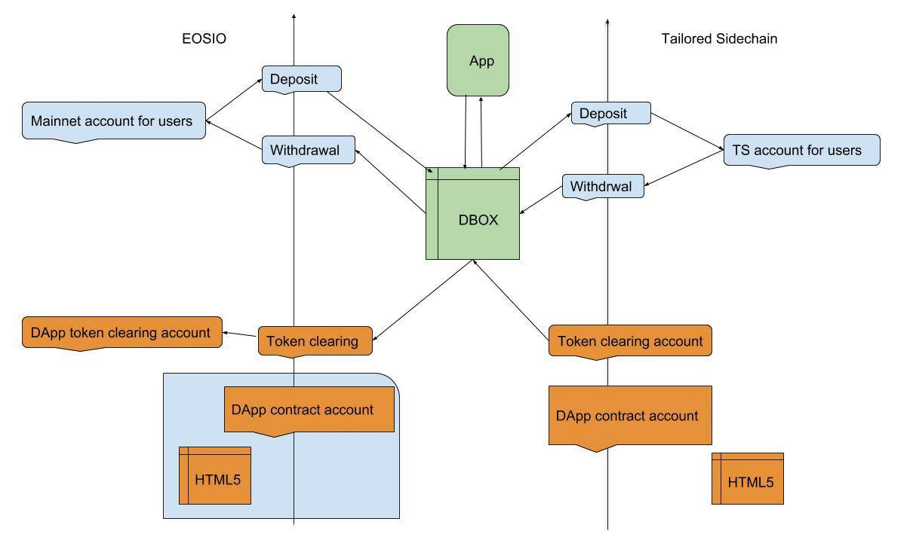
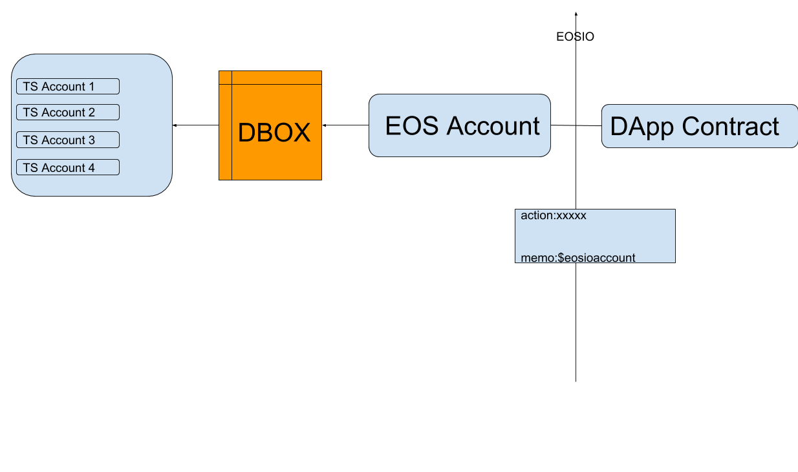

# Technical Guidance for DApps to Enter DBOX

Two technical solutions are now available for DApps to enter DBOX, which are the tailored sidechain(TS) solution and a proxy EOS account.
- Solution 1 mainly takes advantage of a tailored sidechain, whose principle is similar with DApps deployed on the EOS mainnet, settling regularly with the EOS mainnet.
  1) Advantages of this solution are as follows: 1.It is simple and quick for DApps to be deployed on the tailored sidechain; 2.There is no need for DApps to use the EOS mainnet resources like CPU and NET and DApps in DBOX could be provided resources of the sidechain for free. 
  2) However, this also mains the DApp need to deploy a new environment which means open a new server for a game.
- Solution 2 mainly adopts a proxy EOS account to sign for all users with different memo(tag) to tell them apart.
  1) Advantages of this solution: DApps could still run on the EOS mainnet. 
  2) However, this means DApp developers need to change their contracts and remark account name in the memo(tag).

## Solution 1 Tailored Sidechain  (TS）

### Development Notes

HTML5 applies standard Scatter protocal to cummunicate with wallets. Relative documents: ：https://get-scatter.com/docs/examples-interaction-flow
DApp need to use the network of the tailored sidechain when it applied the solution. Code reference:
```
const network = {
    blockchain: 'eos',
    protocol: 'https',
    host: 'espnode.dbox.link',
    port: 443,
    chainId: '0491e54ed0872cf5305fc7ead9bd9fb39c7a8d968aaacfa841385b9d80fc4020 '
}

```

### Deployment Instruction
- Following data need to be submitted to DBOX if the DApp want to enter DBOX.

Name	| Instruction
-------------------|-----------------
DApp contract	|A DApp having its own contracts need to list its contract accounts and submit these acconts names and public key to DBOX.
TS transaction account 	|On TS, transaction accounts for users to transfer when using DApps need to be whitelisted. A DApp need to submit the account name and public key if it choose manual clearing;  Auto-clearing does not require account name and public key.
DApp clearing account on EOS 	|For EOS clearing
Available access	|DApp URL requires that the home page of the DApp must initialize the Scatter protocal, which means Scatter JS object must be contained in window objests.
DAPP Logo	|Picture
DApp brief introduction	|A brief introduction of the DApp
Access to the Android Version	|Android version need to submit the name of the applicaiton package, like com.eosstore.sdk_test 
Download address for android users 	|An address for users to download the the applicaiton.

- DApp having its own token need to submit following information


### Requirements
Account of the token contract on the TS must be the same with that of on the EOS mainnet. Token contract must contain transfer action whose sign must be consistent with that of the eosio.token.


Name	|Notes
--------|----------
token logo	|Picture
Account name of the token contract	|Consistent with the EOS mainnet
Token name	|
Total supply |
Token precision	|
Minimum deposit	|
Minimum withdrawal	|
abi& wasm document |	

1) DBOX will add the DApp at the backend after receiving the data submitted by the DApp and create relative accounts before the DApp could upload the contract via eos api.
```
cleos -u https://espnode.dbox.link/
```
2) A DApp having its own token contract need to provide  its token contract account, abi and wasm documents of the contract. Once receiving these data, staff at DBOX will add the account at the backend before the DApp issuing its token on the TS.

### Parameters
- api of the TS：https://espnode.dbox.link/
- Scatter dev. document：https://get-scatter.com/docs/getting-started
- Download of andriod DBOX ：https://www.dbox.link/android/download/latest.apk

### Technical Architecture



## Solution 2 A Proxy EOS Account
### Development Notes
An overall EOS account means that DApp listed on DBOX could still run on the EOS mainnet and use proxy account to sign transactions.
### Requirements for the Contract
Memo parameter must be added to all contract call methods. The parameter form of the memo should be $eosaccount$. All methods must contain memo parameter and start with the above form.
### DApps Run on DBOX
DApps runnning on DBOX will automatically inject the object ```eosStore``` globally. Content of the eosStore object are as follows:

Name |Type |Note
----|-----|-----
proxyAccount| object |Proxy accout object
proxyAccountMemoPrefix| string |Transaction via proxy accout need to memo prefix
get_currency_balance| function |To get the balance of the tailored sidechain

### Technical Architecture


DApps applying the proxy account solution still use the account on the tailored sidechain when using scatter protocal. However, once related with sign, DApps need to use the proxy accout. Sample code:
```
import {Api, JsonRpc} from 'eosjs';
import ScatterJS from 'scatterjs-core';
import ScatterEOS from 'scatterjs-plugin-eosjs2';
import ScatterLynx from 'scatterjs-plugin-lynx';
 

ScatterJS.plugins(new ScatterEOS(), new ScatterLynx());

 
export default {

  account: null,

  proxyAccount: null,

  eos: null,

  scatter: null,

  network: null,

  eosRpc: null,

  eosStore: null,

  getSignAccount() {

    if (this.proxyAccount) return this.proxyAccount.name;

    return this.account.name;

  },

  getMemo(memo) {

    if (this.proxyAccount)

      return "$" + this.account.name + "$" + memo

    return memo;

  },

  async init() {

    this.network = ScatterJS.Network.fromJson({

      blockchain: 'eos',

      chainId: '',

      host: '',

      port: 8888,

      protocol: 'http'

    });

    while (true) {

      let connected = await ScatterJS.connect('Dinosaur', {network: this.network});

      if (!connected) continue;

      this.scatter = ScatterJS.scatter;

      window.ScatterJS = null;

      this.eosRpc = new JsonRpc(this.network.fullhost());

      this.eos = this.scatter.eos(this.network, Api, {rpc: this.eosRpc, beta3: true});

      this.account = (await this.scatter.getIdentity({accounts: [this.network]})).accounts[0];

      if (window.eosStore && window.eosStore.proxyAccount) {

        this.eosStore = window.eosStore;

        this.proxyAccount = window.eosStore.proxyAccount;

      }

 

      return;

    }

  },

  async getBalance(contract, symbol) {

    if (this.proxyAccount)

      return await this.eosStore.get_currency_balance(contract, this.account.name, symbol)

    return await this.eosRpc.get_currency_balance(contract, this.account.name, symbol)

  },

  async getEOSBalance() {

    return await this.getBalance("eosio.token", "EOS")

  },

  async test() {

    await this.eos.transact({

      actions: [{

        account: 'eosio.token',

        name: 'transfer',

        authorization: [{

          actor: this.getSignAccount(),

          permission: 'active',

        }],

        data: {

          from: this.getSignAccount(),

          to: '',

          quantity: "10.0000 EOS",

          memo: this.getMemo('test'),

        }

      }]

    }, {

      blocksBehind: 3,

      expireSeconds: 30,

    });

  }

}
```
