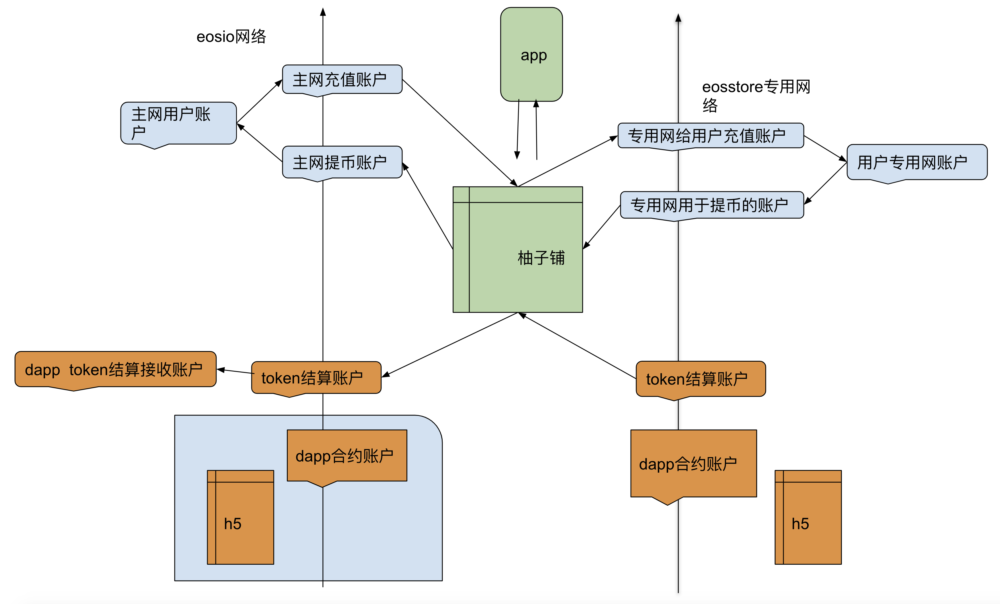

# 柚子铺对接文档
柚子铺针对dapp有两种对接文档: 一种是专用链方案，另一种是大账户方案。

- 专用链方案:与现在EOS主网部署dapp方式相同，与主网定时进行结算。
  - 优点：1.dapp部署在专用链上，部署方便快捷
        2.不占用主网资源，并且免费提供专用链上EOS资源 
  - 对比：需要重新部署一套环境，对于游戏用户来说相当于新开服
- 大账户方案:所有用户都是用一个账户进行签名，但是在memo中备注不同的信息来识别用户。
  - 优点：dapp运行在EOS主网环境
  - 对比：需要合约做相应调整，在memo中备注账户名

## 一、专用链方案
### 开发说明
H5采用标准的scatter协议与钱包通信。 相关文档地址：https://get-scatter.com/docs/examples-interaction-flow 需要配置网络为专用网，参考代码：
```
const network = {
    blockchain: 'eos',
    protocol: 'https',
    host: 'espnode.dbox.link',
    port: 443,
    chainId: '0491e54ed0872cf5305fc7ead9bd9fb39c7a8d968aaacfa841385b9d80fc4020 '
}
```

### 部署说明
- 开通DAPP需要提交以下数据
如果项目方有自己的token需要提交下列信息

名称	| 说明
----------|----------
DAPP合约	|如果DAPP有自己的合约，需要列出合约的账户，仅需提供名称和公钥
专用网收款账户	|在专用网上，用来接收用户玩dapp 时候转账的账户名称，必须在白名单中的账户才可以接收用户的转账，如果设置成手动需提交名称，公钥；如果想设置成自动的，那么不需要提供，系统自动提现。
eos网项目方收款账户	|用于接收eos网络结算的账户
访问地址	|访问DAPP的url，首页打开后必须初始化scatter协议。即window对象必须包含ScatterJS对象
DAPP Logo	|图片
DAPP   说明	|DAPP的说明介绍
Android程序入口	|如果是安卓提供应用的包名。如：com.eosstore.sdk_test
Android下载地址	|提供一个当用户没有安装相应程序的时候打开的网页地址，引导用户下载

- 如果项目方有自己的token需要提交下列信息

### 要求
专用网代币的合约账户必须和主网的合约账户一致。 
代币合约要求 必须包含transfer方法。  
transfer方法的签名必须和eosio.token的transfer方法保持一致。

名称	|说明
--------|----------
token logo	|图片
token的合约账户名	|需要与主网一致
token的名字	|
发行量	        |
token精度	|
最小充值数量	|
最小提现数量	|
abi文件和wasm文件|	


1） 数据提交后由我方人员在后台添加DAPP，然后创建对应的帐号。 帐号创建好之后dapp可通过eos api上传合约内容：
```
cleos -u https://espnode.dbox.link/
```
2） 如果有token合约，可以告诉我们token合约的账号，提供给我们token合约的abi文件和wasm文件；我方人员会在后台添加账号。账号创建好之后，就可以发行token了


### 相关参数
- 专用网 api地址：https://espnode.dbox.link/
- scatter开发文档：https://get-scatter.com/docs/getting-started 
- 安卓钱包柚子铺下载地址：https://www.dbox.link/android/download/latest.apk


### 技术架构


## 二、大账户方案
### 说明
大帐号方案是指DAPP运行在EOS主链上，交易签名通过代理账户进行。

### 合约要求
所有合约方法必须添加memo参数，memo参数格式为 $eosaccount$，所有方法必须包含memo参数，且必须以这个格式开头。

### 柚子铺运行
在柚子铺运行的DAPP，会自动在全局注入 eosStore 对象。eosStore对象内容

名称 |类型 |说明
----|-----|-----
proxyAccount| object |代理账户对象
proxyAccountMemoPrefix| string |代理账户交易备注前缀
get_currency_balance| function |获取私链账户余额

### 技术架构


采用大帐号方案运行的DAPP，通过scatter协议操作的依然是使用的私链账户，但是在涉及签名的地方，需要使用代理账户。 示例代码：

```
import {Api, JsonRpc} from 'eosjs';
import ScatterJS from 'scatterjs-core';
import ScatterEOS from 'scatterjs-plugin-eosjs2';
import ScatterLynx from 'scatterjs-plugin-lynx';
 

ScatterJS.plugins(new ScatterEOS(), new ScatterLynx());

 
export default {

  account: null,

  proxyAccount: null,

  eos: null,

  scatter: null,

  network: null,

  eosRpc: null,

  eosStore: null,

  getSignAccount() {

    if (this.proxyAccount) return this.proxyAccount.name;

    return this.account.name;

  },

  getMemo(memo) {

    if (this.proxyAccount)

      return "$" + this.account.name + "$" + memo

    return memo;

  },

  async init() {

    this.network = ScatterJS.Network.fromJson({

      blockchain: 'eos',

      chainId: '',

      host: '',

      port: 8888,

      protocol: 'http'

    });

    while (true) {

      let connected = await ScatterJS.connect('Dinosaur', {network: this.network});

      if (!connected) continue;

      this.scatter = ScatterJS.scatter;

      window.ScatterJS = null;

      this.eosRpc = new JsonRpc(this.network.fullhost());

      this.eos = this.scatter.eos(this.network, Api, {rpc: this.eosRpc, beta3: true});

      this.account = (await this.scatter.getIdentity({accounts: [this.network]})).accounts[0];

      if (window.eosStore && window.eosStore.proxyAccount) {

        this.eosStore = window.eosStore;

        this.proxyAccount = window.eosStore.proxyAccount;

      }

 

      return;

    }

  },

  async getBalance(contract, symbol) {

    if (this.proxyAccount)

      return await this.eosStore.get_currency_balance(contract, this.account.name, symbol)

    return await this.eosRpc.get_currency_balance(contract, this.account.name, symbol)

  },

  async getEOSBalance() {

    return await this.getBalance("eosio.token", "EOS")

  },

  async test() {

    await this.eos.transact({

      actions: [{

        account: 'eosio.token',

        name: 'transfer',

        authorization: [{

          actor: this.getSignAccount(),

          permission: 'active',

        }],

        data: {

          from: this.getSignAccount(),

          to: '',

          quantity: "10.0000 EOS",

          memo: this.getMemo('test'),

        }

      }]

    }, {

      blocksBehind: 3,

      expireSeconds: 30,

    });

  }

}
```

## 三、分享分佣接入说明
### 说明
分享分佣是指给每个DAPP单独设置一个分享分佣的活动，每个用户对于一个dapp都有一个专属的邀请码，通过上下级关系建立用户的结构，每个活动会自动生成一个EOS Account，DAPP方需要在用户发生交易的时候将反拥的部分转回该帐号，并且备注玩家的帐号。

### 合约要求
转账接收者必须是DAPP分享分佣活动自动生成的帐号，memo参数必须为玩家EOS帐号。

### 柚子铺运行
在柚子铺运行的DAPP，会自动在全局注入 eosStore 对象。eosStore对象内容
		
名称 |	类型|	说明
----|-----|-----
shareTaskUserCode	|string	| 当前玩家的分享码
shareTaskUserInviter|	string	| 当前玩家的上级分享码
shareTaskUserJoinAt |	datetime| 当前玩家加入分享的时间
shareTaskSetInviter	| function| 设置当前玩家的上级，返回值：Promise对象


DAPP分享码设置方案有2种，DAPP方可以根据情况选择：
  
- 自己开发设置分享码的界面，自己开发分享码时需要判断上级是否等于null，等于null才弹出设置界面。
  
- 直接载入js https://www.dbox.link/dapp_set_inviter/loader.js，会自动在dom加载后弹出输入框。
